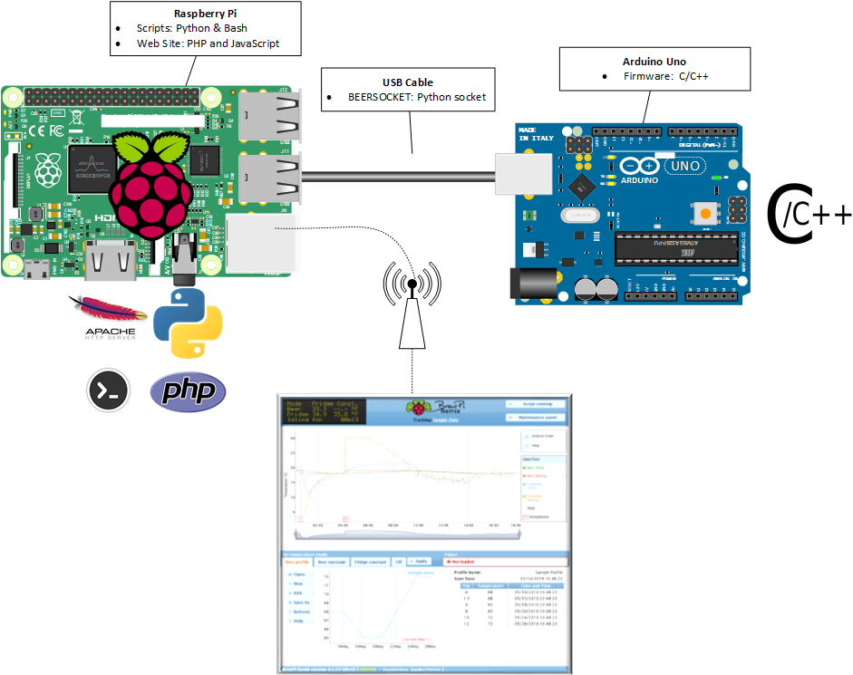

BrewPi Remix API
================

BrewPi Remix functions via interopeation of three different parts of the project:

- Firmware - This is the compiled application running on the controller
- Scrips - Python and shell scripts designed to receive and make available data from the controller, and send commands back to the controller
- Web Pages - A web application written in PHP and JavaScript

Communication takes place in the following manner:

- Firmware <-> Script:  The Python Script on the Raspberry Pi opens serial communications over the USB cable with the Arduino Controller.  Two way communication is possible via specially formatted JSON messages.
- Web Server <-> Script:  A PHP socket called `BEERSOCKET` is created within the filesystem.  This socket allows two-way communications between the web server and the Script via specially formatted messages.
- End User <-> BrewPi Remix - The end user opens a web page served by Apache 2 running on the Raspberry Pi.  The web pages are written in PHP and JavaScript.  The web server allows commands to be sent to the Script via the `BEERSOCKET` and the Script in turn will communicate with the Controller as needed.  Data to display on the web page is sent to the web server throgh `BEERSOCKET` as well as filesystem information.

Arduino Commands
----------------

The following commands are issued by the Script to the Arduino Controller.  If desired, these commands may be sent to the Controller through a terminal emulator.

- A - Alarm on
- a - Alarm off
- t - Request temperatures
- C - Set default constants
- S - Set default settings
- s - Request control settings
- c - Request control constants
- v - Request control variables
- n - Request firmware version information
- l - Request LCD contents
- j - Set settings as JSON
- e - Request contents of EEPROM
- E - Initialize EEPROM
- d - Request devices in EEPROM order
- U - Update device
- h - Request hardware
- Z - Zap EEPROM (in DEBUG mode only)
- R - Reset controller

Arduino Message Types
---------------------

The following characters define the JSON message type sent to and returned by the Controller.  They are hte first character of the JSON message.

- T - Temperature info
- D - Debug message
- L - LCD content
- C - Control constants
- S - Control settings
- V - Control variables
- N - Version number
- h - Available devices
- d - Installed devices
- U - Device update confirmation

BEERSOCKET Commands
-------------------

The following messages are sent through the `BEERSOCKET` from the web server to the Script.  These may also be send manually using the `{web_root}\sockettest.php` page.

- ack - Acknowledge request (test message)
- lcd - Request LCD contents from script
- getMode - Request mode setting from script
- getFridge - Request fridge temperature setting from script
- getBeer - Request beer temperature setting from script
- getControlConstants - Request control constants from script
- getControlSettings - Request control settings from script
- getControlVariables - Request control variables from script
- refreshControlConstants - Request control constants from controller
- refreshControlSettings - Request control settings from controller
- refreshControlVariables - Request control variables from controller
- loadDefaultControlSettings - Reset control settings to default
- loadDefaultControlConstants - Reset control constants to default
- setBeer - Set new beer constant temperature
- setFridge - Set new fridge constant temperature
- setOff - Set mode to OFF
- setParameters - 
- stopScript - Stop script, write semaphore
- quit - Quit but do not write semaphore
- eraseLogs - Erase stderr and stdout logs
- interval - Set new logging interval
- startNewBrew - Set new beer name
- pauseLogging - Pause logging, may be resumed
- stopLogging - Stop logging, may not resume
- resumeLogging - Resume logging
- dateTimeFormatDisplay - Change date time format
- setActiveProfile - Set a new beer profile
- programController or programArduino - Reprogram controller
- refreshDeviceList - Request devices from controller
- getDeviceList - Request device list from script
- applyDevice - Create device settings
- writeDevice - Configure a device
- getVersion - Get firmware version from controller
- resetController - Erase EEPROM

Config.cfg Settings
-------------------

These settings control how the application behaves.  They are set in the `{app_home}/settings/config.cfg` file.  Not all are mandatory.

- altport - Checks this port definition if the controller is not found on "port"
- beerName - Name of the beer currently being logged
- dataLogging - Defined whether data loogging is active, paused, or stopped
- interval - Time period between data points
- iSpindel - Defines use of iSpindel (not currently in use)
- logJson - Log every received line from the controller if True, False only logs 'New JSON received.', when not defined, JSON messages are muted
- port - Port at which the script will communicate with the controller.  If 'auto' it will connect to the first controller found on the USB bus.  May also be explicit such as /dev/ttyACM0 or /dev/chamber1
- scriptPath - Path where the brewpi.py script may be found
- tiltColor - Color of currently connected Tilt
- wwwPath - Path to current chamber's website
- useInetSocket - Windows only, set to true to allow Inet socket use
- socketPort - Windows only, set to port for socket (default 6332)
- socketHost - Windows only, set to IP address for socket (default localhost)
- arduinoHome = Set to location of arduinoHome, defaults to /usr/share/arduino
- avrdudeHome = Set to location of avrdude, defaults to arduinoHome/hardware/tools/
- avrsizeHome = Set to location of avrsize, defaults to empty string because avrsize is in path on Linux
- avrConf = Set to location of avrdude.conf, defaults to avrdudeHome/avrdude.conf
- boardType = Defaults to 'arduino', no longer used
